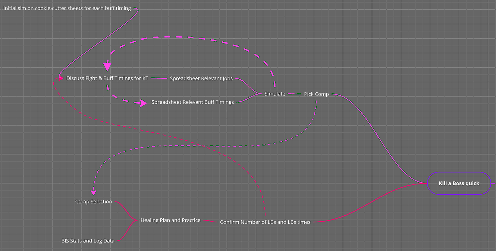
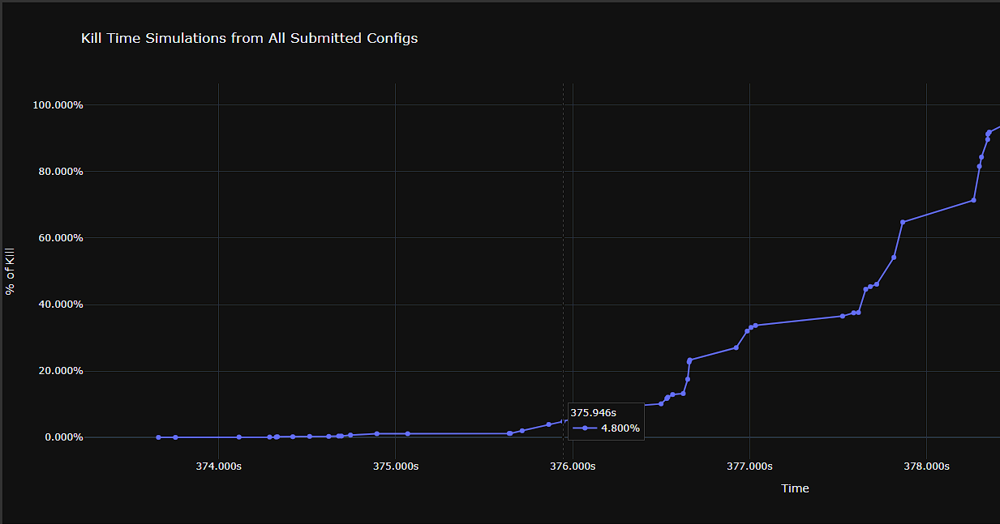
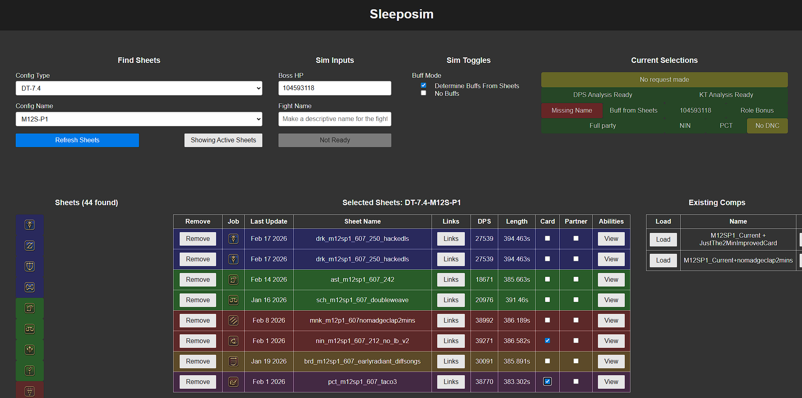
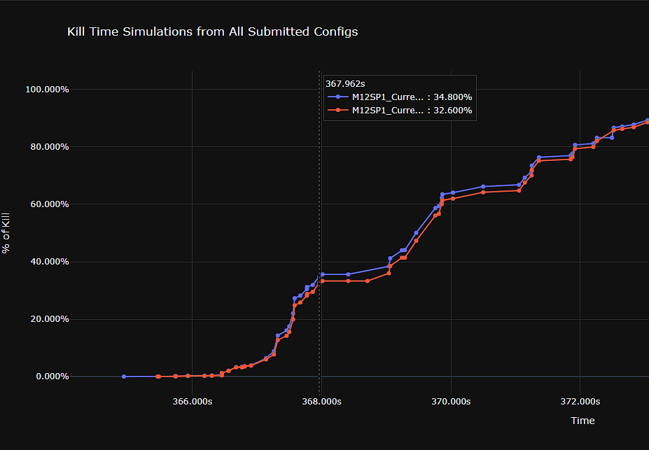
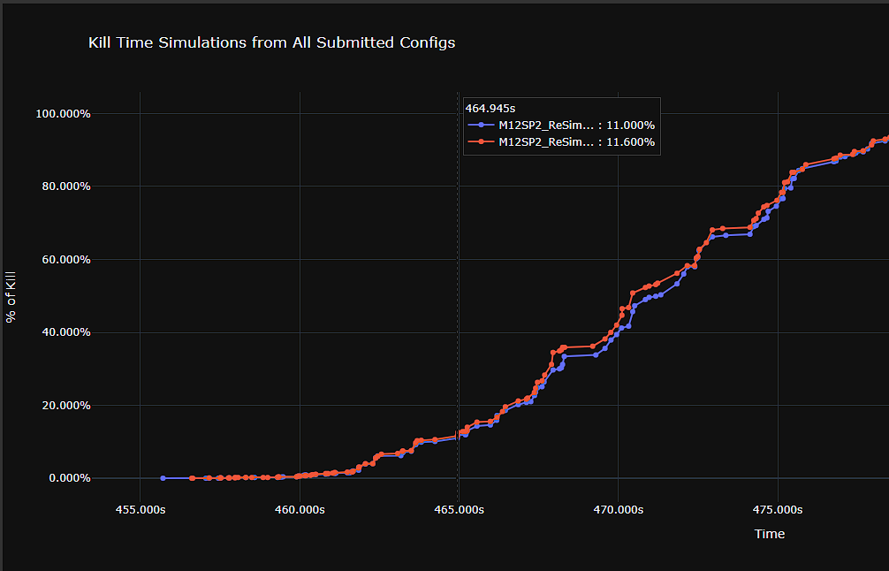
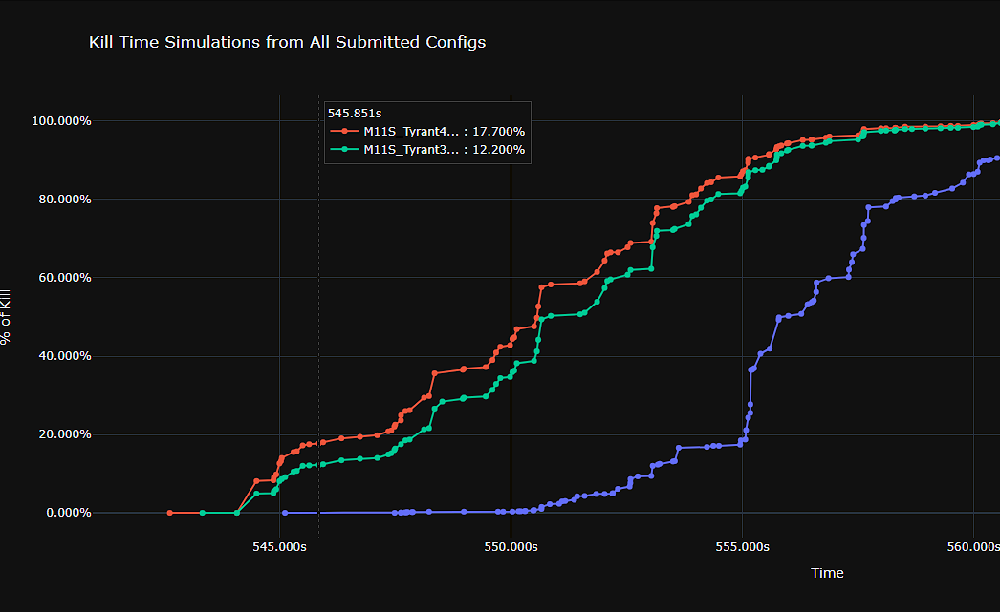
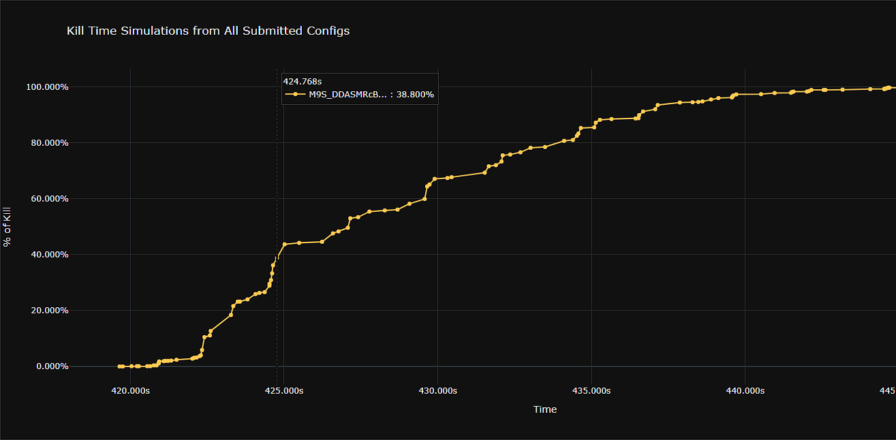
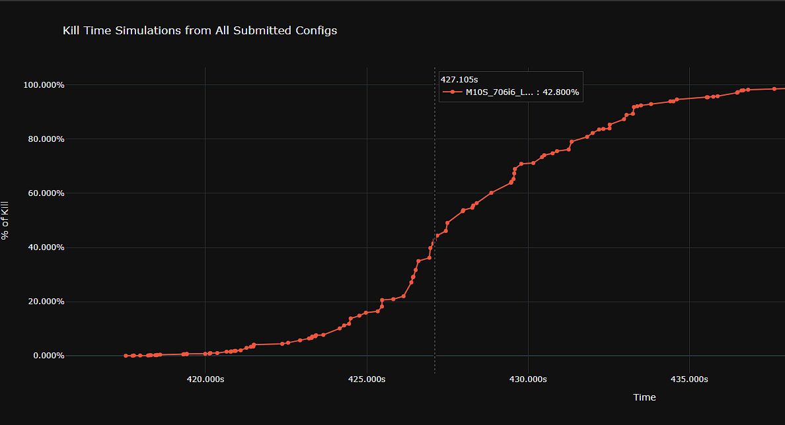

# Parryprog Patch 7.4 Speeds: An Inside Look

## Introduction

Hello! I'm Apollo, a bit of a FFXIV speedkill enthusiast. I worked with the team *parryprog* for the Arcadion Heavyweight tier, 
helping them out with rotations and simulations. Now that everything is wrapped up for 7.4, I'd love to share some of the
inner workings of the team, how we planned runs, and some weird challenges we came across on our journey to post
times for all five fights.

## Planning the Fights

Before working with a team, I love to present this little diagram: it goes over a simple mental model for planning as 
a flow chart, while also making it clear that we will need to iterate and repeat steps to narrow down our plans.

  

We actually start with using full uptime target dummy rotations compared to the boss HP bar to get an upper bound on the 
estimated killtime, then whittle those down by optimizing sheets with new buff timings and killtime specific optimizations.
That's actually what all the [12:30 target dummy sheets I shared in 7.4](https://apollo-van-waddleburg.github.io/patch-74-sim-results/) 
get used for. 

Let's work through a basic example: below is a target dummy comp simmed against a boss with `104593118` hp (doorboss).
This spits out something like a 6:15 as a possible time. However, we have to consider that the boss has about 12 seconds of 
downtime (which will slow us down), but also these sheets are using buffs at x:06, which is suboptimal if the 
kill-time is much faster than say, 6:26. So moving buffs earlier will speed us up! 
But then again, what about limit-breaks? How many do we think we can send?

  

As a team, we would start to sheet iterations on this based on our best guesses. And this process is inherently cyclical: 
as you continue to iterate on rotations or plan out better limit-break generation, you will continue to push the goal killtime 
lower and lower. At some point, you are actually limited by time via how many loops of this cycle you can sheet out 
(or you hit some optimal plan given your goal). This gets even worse if you are working on multiple fights, 
since time spent planning one fight is not spent on another. Once you realize this, you start to think about how to optimize
the planning phase.

### The Sleeposim :tm:

To help our planning process, I wrote up a set of tools called the *Sleeposim*. It's somewhere in the middle of
[xivintheshell](https://xivintheshell.com/) (a rotation planner) and [Ama's Combat Sim](https://pypi.org/project/ama-xiv-combat-sim/#description), allowing teams to easily
submit rotations, track them, build full parties, run simulations, and track your favorites. Its main goal is to 
help speed up the iteration process by allowing all members of the team to kick off their own simulations and experiments, 
whereas in the past it was usually a bottleneck, with most teams having only one person who could write code and run sims (if 
they even had access to a sim).

  

This has been a project of 
mine since 7.0 (hence the name), but as of 7.4 it has actually been accessible to any speeds team or theorycrafter who has asked me about it.
This is just one of the planning tools we used though: some day, y'all might see more about the probabilistic healing 
and player threshold management simulator that Caro and Yun used this tier, but I leave that to them...

### Time as the Core Resource
The meta point to all of this is that **time** is the most precious resource for a speeds team.
* Our goal killtime is a function of how much time we invest in rotation planning and playing the game.
* Limit-break usage is a function of time spent planning our healing and practicing in game.
* Rotations require time to sheet and validate to prove they are the most effective for our goal.
* Comp selection requires time to sheet finish 8+ sheets and then compare results.
* Custom strats take time to figure out and practice.

A good group will always try to spend their time in the most effective way. With this mindset, we made a 
lot of concessions on every fight: 
* We generally shot for runs with significant success rates (usually 20%+) and committed to moving on the instant we got it.
* We set strict timelines to finish sheeting for a fight so we can plan every floor adequately.
* Limit-break was scoped mindfully and plans were designed with simple execution in mind.

## The Fights 

I'll take a bit of time to go into each fight specifically and share some learnings. I'll break down goals, challenges,
and what we took away from each fight. The sections will match the order in which we took on each floor, but before any
 of that, I'll share some metrics on how much time was really spent on each floor.

| Encounter | Result | Combat Time | Total Pulls | Total Kills |
| :--- | :--- |:------------| :--- | :--- |
| **M9S** | 7:05 | 18 Hours    | 405 | 2 |
| **M10S** | 7:07 | 14.5 Hours  | 232 | 4 |
| **M11S** | 9:19 | 9 Hours     | 136 | 1 |
| **P1** | 6:09 | 12 Hours    | 286 | 20 |
| **P2** | 7:44 | 20.5 Hours  | 359 | 6 |

This hopefully adds context into how deeply we explored all the possibilities on each floor.

### M12S-P1

6:09: [Log](https://www.fflogs.com/reports/62GyMwnZrvbTFBWq?fight=17&type=damage-done) and [VOD](https://www.fflogs.com/video/view/73/fight/145079031)

Lindwyrm I is very quick and dies in the middle of the 6min burst: our goal was 6:07 using LB32 (1 LB3, 1 LB2). 
The idea for this time was that it's pretty hard to go faster because so much damage is packed into every second of the
6:00 window. This creates serious diminishing returns, so we committed to a pretty easy plan with a high probability.

  

There were issues in execution though: this fight needs very tight ordering in that last window, and that ended up 
falling through in the clear. There were several pretty big abilities that landed after 6:07, which just can't happen
if you wanna have good odds for your time. In the end, we only got a 6:09 and had to move on due to scheduling.

Our time was beaten quite a bit by another team, *???* 
(6:05, [log](https://www.fflogs.com/reports/Q2PgyCLn8qHmRVMF?fight=44&type=damage-done) and 
[VOD](https://www.fflogs.com/video/view/73/fight/147663517)): they actually have a pretty solid writeup 
[here](https://docs.google.com/document/d/1SUVqa3CQPJEfFi2L_g9cHBKKGQ40_CSsuEzyqQsbkI8/edit?tab=t.0) that goes a lot more into how to plan this fight, so I'll leave it to them!

### M12S-P2

7:44: [Log](https://www.fflogs.com/reports/c6ajHhAGy9Bw7qWz?fight=27&type=damage-done) and [VOD](https://www.fflogs.com/video/view/73/fight/146722739)

This fight is a lot different compared to the previous one since it does not die cleanly in a two-minute window. In these
cases, you need to explore possibilities with delayed buffs. Delayed buffs can significantly improve the first window
for some jobs: here are some examples.
* BRD can use two codas for its first window if you delay at least to ~40s, and all three if you do ~1:15 or later.
* MNK can use Phantom Rush in its first buff window if you delay to at least ~40s.
* RPR can double enshroud the first window if you delay to at least ~40s.

This leads to some common non-standard openers: ~40s, 1:00, or even later can all work in some cases. 

In this case, we settled on 1:03 for our opening buff window: the main motivating factor is that 1-minutes can supply
jobs with ranged attacks (Fire's Reply, Ninjutsu) that allow them to handle downtime during mechanics like Replication 2.
Starting the buff window a little earlier also gave us overhead to drift them slightly: MNK is very effective at firing
LBs if you can plan to end them at the end of buff windows, so the MNK can sheet a Six-sided Star under buffs. This however
causes the MNK to misalign their GCD, requiring either a hard GCD clip to stay aligned or a coordinated buff delay by about 
1 second to avoid this hard clip.

In the end, we set a goal of 7:44 via LB331 and ended up getting it in a pretty reasonable amount of time.

  

We did spend a lot of extra time theorycrafting this fight though: you can utilize the doorboss phase to carryover
full resources into the second half of the fight, allowing jobs like RPR to really shine. When we simmed out this possibility, 
we settled on a 7:42 with LB32 as a reasonable possibility, but we discarded the idea for a few reasons:
* Spending 7+ minutes prepping each pull was a significant time expense.
* The loss of LB via carryover from not being able to use the LB opener for 1.5 bars mitigated the net gains from carryover.
* We could be more aggressive with strats since we had less setup cost per pull.
* Our RPR player wasn't BIS and wouldn't be for a while.

A small aside, but all of this planning was done pre 7.45, which included significant buffs to RPR. We wouldn't have 
changed our decision, but it was a little annoying to see that. But if you are interested, there was a Korean group 
that spent the tier doing RPR carryover runs 
(7:40, [log](https://www.fflogs.com/reports/KjDrwdWLPGxHCv1q?fight=2&type=damage-done) and [VOD](https://www.fflogs.com/video/view/73/fight/147655352)). 
They also opted to go for LB33 with their carryover, which was a little more than we would have gone for given time constraints.

### M11S

9:19: [Log](https://www.fflogs.com/reports/c7f4GQZ8AyWB2H3J?fight=56&type=damage-done) and [VOD](https://www.fflogs.com/video/view/73/fight/145995014)

To be very blunt, this was a throwaway floor for the team. We did not prioritize this fight at all since we felt that 
M9S and M10S would be much more interesting fights, so we basically sent some simple LB and rotations down the line. 
Even the buff timings are pretty simple given that any delays would cause issues with the whole split arena mechanic.

  

Included are some projected simulations for times if we ran a lot more limit-break in this fight. Using LB333 or 
more could easily make this fight something like a 9:04 or faster, with maybe some additional optimizations getting 
close to a sub-9m time. However, no team was able to spend the time necessary to do this, so 9:19 stuck as the fastest time
for this fight despite being very unoptimized.

### M9S

7:05: [Log](https://www.fflogs.com/reports/6pTWDkfYgPKQ4tBq?fight=20&type=damage-done) and [VOD](https://www.fflogs.com/video/view/73/fight/147342228)

M9S was the first "weird" fight we tackled this tier. It involves multiple add phases that vary in their complexity, so
we needed to stress how to effectively kill adds without burning any resources that could be spent on boss damage. There
also was a "skip" possible with Hell-in-a-Cell, where we could avoid needing to send any damage into the cell adds by 
killing before 7:05 (and letting everyone in the first set die). Our initial sims on a target dummy showed this time 
was plausible with two LB3s, so we committed to doing at least 7:05 and accepting death if we failed to make the time.

We also changed our process on this fight for theorycrafting. Normally, we would all agree on specific buff timings and 
independently sheet, then sync and iterate on the team. This time around, I personally wrote 7/8 sheets for the initial 
draft and wrote out the entirety of the add cleave plans to ensure we didn't have any miscommunications or unnecessary 
losses to adds. We eventually were able to swap back to a team effort (the actual players handled followup sheets), 
but this change in process seemed to work out since we could have a centralized plan for adds.

The other special thing we did on this fight was explore RPR, because we noticed a lot of good things about the job.
* RPR has the ability to send free cleave at arbitrary times, which proved really valuable for the add phase, specifically for the 2nd set of tower adds.
* RPR can double enshroud if we delay the first buffs to ~0:40, which is possible for a 7:05 goal time.
* RPR can actually "cheat" an extra enshroud in the fight by utilizing Whorl of Death to apply extra Death's Design.
  * We accelerated the rotation with +40 gauge to allow a triple enshroud at the end.
* RPR freed up other jobs to put less into the adds. 
  * A key example was our MNK rotation was allowed to move their Riddle of Wind to the coffinmaker phase to keep uptime.

All of these panned out to make RPR worth taking for our goal time of 7:05, and we had a very high chance of actually 
getting it. This was perfect, since we needed to get this fight done and finish the tier with M10S!

  

All this being said, I think there were some oversights in the rotations. We aligned on a 0:40 buff timing because 
we actually wanted to send our first LB3 before the boss leaves at 1:08, but this proved to be very tight to execute in 
practice and not worth doing for time efficiency. We also scrapped an extra lb1 at the end and brought double drk, 
which further reduced the need to actually run a 0:40 opener, but we never had the time to reassess the buffs and 
needed to commit to possibly suboptimal buff timings. I think with a lot more fine-tuning and a bit more farming, this 
could have easily gotten to a 7:02, but we would have lost out on time for M10S.

There was also some cleaving inefficiencies we needed to work out in instance and some decisions that were never 
reassessed: the main one being the RPR rotation moving Plentiful Harvest to the end of the 4:40 window to snipe 
the far tower add to ensure a kill. In practice, this actually wasn't that necessary and just having the BRD or someone 
spot a gcd or two if we didn't crit much could have been fine. That said, we did keep a lot of the "safety" cleave 
to keep our consistency as high as possible.

Now, the real big shocker on this fight was a Chinese team pulling off a 6:58 
([log](https://www.fflogs.com/reports/AqHm26khrWJRCvzx?fight=1&type=damage-done) and [VOD](https://www.fflogs.com/video/view/73/fight/147666431)).
These are some of the same players from *huaimao*'s M6S run in 7.2, so they are real masters of this type of fight. 
They posted their thoughts on this specific fight [here](https://www.bilibili.com/opus/1196242670813446162?spm_id_from=333.1007.0.0), 
which you would need to use machine translation for unless you understand Chinese, but I can summarize some of the key 
points:
* They used LB3332, which is over almost twice as much as we did! This is **insanely** difficult, so hats off to them.
  * They basically never healed to full, so any mistakes in overhealing or failing a buff removal would have failed this run.
* They also had very few clears (3)
* They ran a more normal 0/2/4/6:30 timing, allowing them to actually send a LB2 after buffs. 
  * This LB2 is pretty interesting since it utilized the Hell-in-a-Cell damage ticks to generate LB (they aren't dots actually, so they generate LB).
  * They also used HP pots in their plan since they could fit them in before the 2:00 Pot window. 
* They used RDM instead of RPR to supply the on-demand cleave.
  * RDM also works for this and is relatively strong, so losing PCT isn't that bad.
    * It also has its own complications, namely RNG on resource generation.
  * RPR can possibly work for this, but both is probably overkill and RPR would need to send more Whorls of Death for end on a shroud.
    * NIN also works better for this alignment, whereas we actually found RPR stronger than NIN on single-target for our buffs.
    * RPR also can't double shroud the first buff window with their planned timings, which makes RPR a bit worse.
* They utilized the fact that the first Nail add has about twice as much hp as the more urgent Tower adds, so they left the first one alive and killed it with the second set.
  * In contrast, we used the end of our 4:40 window to instantly nuke that nail add.

This run is amazing (this group does amazing work every tier), so I learned a lot seeing how far they took this fight.
I would also point to this fight for new speed teams to study, since you have two teams with different goals and circumstances 
coming up with unique solutions. There's a lot to learn here!

Also, Vamp Stomp was the most deadly mechanic for the team this whole tier. Take that as you will: seems like Europeans 
can't resist getting stepped on.

### M10S

7:07: [Log](https://www.fflogs.com/reports/28kP43gqW9RaLCpT?fight=54&type=damage-done) and [VOD](https://www.fflogs.com/video/view/73/fight/147613054)

This was the last fight of the tier for us, and it was a lot of fun. This is the rare two-target fight, so a lot of 
our existing knowledge for this fight was rendered useless: we needed to check a lot of jobs. What we settled on was
using both RDM and PCT and replacing the powerful SCH with WHM:
* RDM was incredibly powerful for the cleave windows, at some points being even better than the PCT for cards.
* WHM has a lot of cleave so it made sense from pure damage, but we also didn't need to generate much LB which is SCH's main strength.
  * The main mechanic we wanted to use SCH for was the Xtreme Spectacular, but the proximity was too inconsistent to generate limit-break with.

That left our solo melee as the final job pick, and we ended up with NIN. Most of them actually seemed playable in the 
fight, but NIN was a comfort pick and simmed the best due to card feed. RPR was another strong option, but it seemed 
to be more risky to execute.

The other odd thing we found was PCT's LB being very good. Generally, this can end up being a loss since a caster LB3 
locks the player for about 12 seconds vs a ranged LB3's 8 seconds. These few GCDs can often make up the difference in 
value, but our LB timings were always right before downtime (or were the killing blow), so we never paid for this loss.

This is also where I fess up that I barely worked on this floor at all: while I was tasked to figure out M9S, the team 
spent their efforts on M10S to fine-tune the job picks and cleaving math. Sometimes you need to divide-and-conquer the 
brainwork for these fights since there's so much to look into.

Our goal was a 7:06, which was very barely missed since the final LB3 didn't kill both bosses. However, 7:07 was more
than satisfactory for the team.

  

And that's the tier! This run was extra exciting since this was on our last session, showing that we really did allocate
every session and our planning properly for a complete tier.

## Conclusions and Thoughts

All in all, this tier was very fun and rewarding. We achieved all of our main goals and ended up 
with the overall best ASP for speeds. While I do think there's a lot less competition than in the past, the important 
part for us was being able to find the right goals for our team, meet them, and still have some fun along the way. 

I'd like to end this document with some advice to players who might be looking to start their own teams: you can 
definitely gain a lot by utilizing the existing logs and public knowledge to practice in the downtime. While Evercold
will change a lot of rotational optimization, speeds is an exercise of time optimization: setting reasonable goals,
supporting these goals with math and simulations, and playing well enough to reach them.

More specifically, I feel like M9S and M10S would be great to study since there's a lot of theorycraft behind those 
fights that you can see in practice with the completed runs. Maybe you can come up with some new ideas! 
Feel free to reach out if you would like ideas on what to do in the downtime to practice!

### Random

*parryprog* refers to the parry mechanic in FFXIV, which has a low probability to slightly mitigate physical damage. 
This makes planning fights like Brute Bomber very difficult, since he deals a lot of physical damage, and you can end up
taking way less than expected. This sounds like a good thing, but you want to be taking exactly as much damage as you 
expect so you can generate as much limit-break as possible. So *parryprog* refers to the extra prog time it takes 
to learn how to deal with random parries, like strategically removing extra mitigation to "fix" your hp to get back on 
track for limit-break gen.

Parry can also lead to a lot of funny tech: you are unable to parry when casting, so it's possible to time casts to 
prevent parries in specific cases. And for non-casters, you could find weird use-cases for items like a 
[Realm Reborn Red](https://ffxiv.consolegameswiki.com/wiki/Realm_Reborn_Red) to force a cast if you really needed to.

## Credits

* **Ama** for providing an open-source simulation tool in Python, which was used extensively for this project
    * [Pip](https://pypi.org/project/ama-xiv-combat-sim/#description)
    * [xivraider](https://xivraider.com/)
* **Shanzhe** and the supporting team for [xivintheshell](https://xivintheshell.com/) for a public rotation tool.
* [xivgear.app](https://xivgear.app/) for their gearset support and damage validation.
* [parryprog](https://www.fflogs.com/guild/id/135994/) for working with me this tier!

### P.S

If you are interested in speeds or spreadsheet theorycraft, please reach out to me on discord (apollo.van.waddleburg).
I love talking about these things, so I'll always try to respond to any questions.
